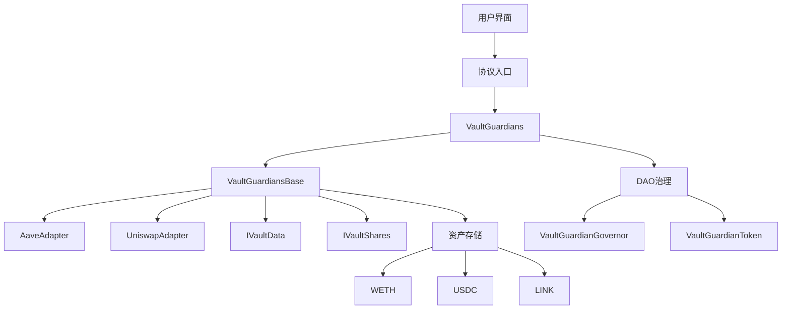
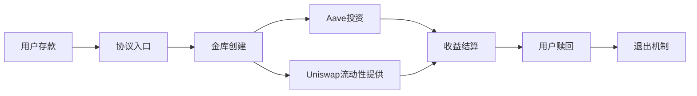
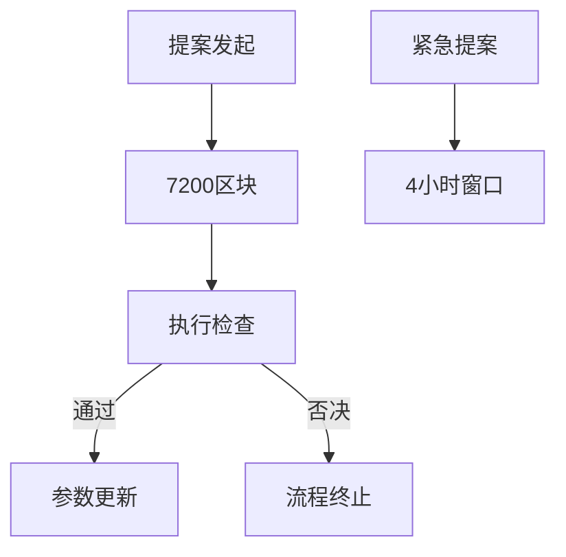

# Vault 金库守护者系统

- [Vault 金库守护者系统](#vault-金库守护者系统)
  - [项目简介](#项目简介)
  - [系统架构](#系统架构)
    - [整体架构图](#整体架构图)
    - [资金流动流程](#资金流动流程)
    - [治理流程](#治理流程)
  - [用户流程](#用户流程)
  - [DAO 治理](#dAO治理)
  - [项目概述](#项目概述)
- [快速入门](#快速入门)
  - [环境要求](#环境要求)
  - [快速启动](#快速启动)
- [开发指南](#开发指南)
- [其他信息](#其他信息)

## 项目简介

本协议是基于**ERC-4626 标准**构建的去中心化资产管理解决方案，创新性地将人类专业管理与智能合约安全机制结合，为加密资产提供可验证、可持续的收益策略。可以将`金库守护者`理解为基金管理员。

### 核心价值

- **专业管理**：通过质押机制筛选专业资产管理者（金库守护者）
- **资金安全**：强制资金仅能流向预设协议（Aave v3/Uniswap v2）
- **双重激励**：守护者通过绩效费用获利，DAO 获得协议收益分成
- **灵活升级**：模块化架构支持未来新增投资协议

### 核心机制

#### 安全防护

1. **协议白名单**：资金仅限投资以下平台

   - [Aave v3](https://aave.com/)（借贷协议）
   - [Uniswap v2](https://uniswap.org/)（流动性提供）
   - 零风险持有（WETH/USDC/LINK）

2. **调仓限制**：
   - 仅可在预设协议间转移资金
   - 禁止向外部地址转账
   - 所有操作需符合 ERC-4626 标准

#### 收益模型

- **动态分配**：支持实时调整资产在不同协议的分配比例
- **双重激励**：
  - 守护者获取管理费+绩效分成
  - DAO 获得协议收益的固定比例
- **透明结算**：通过智能合约自动分配收益

#### 进入/退出机制

- **成为守护者**：

  - 质押指定数量 ERC20 代币（当前为 10 ETH 等值）
  - 创建专属金库并开始管理用户资金

- **退出机制**：
  - 必须返还全部用户资产
  - 可取回原始质押金
  - 金库进入不激活模式，用户可调用函数退款

#### 可扩展架构

采用模块化设计，可通过以下方式升级：

- 新增支持协议：通过 DAO 投票添加新投资渠道
- 参数调整：动态更新质押金额、收益分成比例
- 策略优化：升级调仓算法而无需迁移用户资金

### 技术亮点

- **多层架构设计**：抽象层/接口层/核心协议分离，提升可维护性
- **动态分配策略**：支持实时调整 WETH/USDC/LINK 等资产在不同协议的分配比例，还可以在后续通过 DAO 投票增加对更多代币的支持
- **自动再平衡**：通过 Uniswap 和 Aave 的智能合约集成实现自动化调仓，只需要管理者修改分配比例即可
- **治理代币经济**：DAO 和管理者可以在用户质押代币进入金库获取份额的时候得到少量份额，这些份额可以激励管理者提高金库的收益，从而让管理者手上的份额能兑换出更多的代币。

### 应用场景

- 机构级加密资产托管
- 主动管理型 DeFi 投资基金
- 可验证收益策略的流动性提供
- 去中心化资产管理人认证体系

## 用户流程

1. 用户向守护者的金库存入 ERC20 代币
2. 守护者根据其策略自动调配资金
3. 守护者可随时更新策略配置并调整资金分配
4. 用户通过调用`redeem`或`withdraw`退出资金池

## DAO 治理

基于`VaultGuardianToken`（VGT）的去中心化治理系统，采用双重治理架构：

### VGT 代币功能

- **治理权**：1 VGT = 1 票投票权，用于参数更新和协议升级

### 治理流程

1. **提案发起**：需持有至少 1% VGT 供应量
2. **投票周期**：7200 区块（约 24 小时）
3. **执行阈值**：需达到 4%参与率且多数赞成
4. **紧急治理**：重大风险事件可触发快速投票（4 小时窗口）

### 核心治理权限

- **参数更新**：

  - 守护者质押金额（当前为 10 ETH 等值）
  - 收益分成比例
  - 添加支持的代币池配置（WETH/USDC/LINK）

## 系统架构

### 整体架构图


### 资金流动流程


### 治理流程


## 项目概述

本协议基于 ERC-4626 标准，采用模块化架构设计，主要包含以下核心组件：

1. **抽象层**（`/src/abstract`）

   - `AStaticLinkData.sol`：定义 LINK 代币存储结构
   - `AStaticUSDCData.sol`：定义 USDC 代币存储结构
   - `AStaticWethData.sol`：定义 WETH 代币存储结构

2. **DAO 治理**（`/src/dao`）

   - `VaultGuardianGovernor.sol`：基于 OpenZeppelin 的治理合约
   - `VaultGuardianToken.sol`：治理代币实现（ERC20+投票权）

3. **核心协议**（`/src/protocol`）

   - `VaultGuardians.sol`：入口合约，管理守护者质押和 DAO 控制
   - `VaultGuardiansBase.sol`：核心逻辑合约
   - `VaultShares.sol`：基于 ERC4626 的金库份额管理
   - `investableUniverseAdapters/`：Aave 和 Uniswap 集成适配器

4. **接口定义**（`/src/interfaces`）
   - `IVaultData.sol`：定义资产分配策略接口
   - `IVaultShares.sol`：定义金库操作接口

# 快速入门

## 环境要求

- [git](https://git-scm.com/book/en/v2/Getting-Started-Installing-Git)（版本控制工具）
  - 安装成功后运行 `git --version` 应显示 `git version x.x.x`
- [foundry](https://getfoundry.sh/)（智能合约开发框架）
  - 安装成功后运行 `forge --version` 应显示 `forge 0.2.0 (816e00b 2023-03-16T00:05:26.396218Z)`

## 开发指南

### 安装依赖

```bash
forge install
```

### 编译合约

```bash
forge build
```

### 运行测试

```bash
forge test
```

### 部署合约

1. 配置网络参数（参考`script/NetworkConfig.s.sol`）
2. 部署金库守护者系统：

```bash
forge script script/DeployVaultGuardians.s.sol:deployVaultGuardians --broadcast
```

## 测试指南

单元测试位于`test/unit/`目录，包含以下测试套件：

- `VaultGuardiansBaseTest.t.sol`：核心逻辑测试
- `VaultGuardiansTest.t.sol`：入口合约测试
- `VaultSharesTest.t.sol`：金库份额管理测试
- `VaultGuardiansFuzzTest.t.sol`：模糊测试

# 其他信息

- [文档标题样式来自 t11/headers](https://github.com/transmissions11/headers)
- 本项目采用[OpenZeppelin Contracts](https://github.com/OpenZeppelin/openzeppelin-contracts)作为基础依赖
- 金库逻辑遵循[ERC-4626 规范](https://eips.ethereum.org/EIPS/eip-4626)
